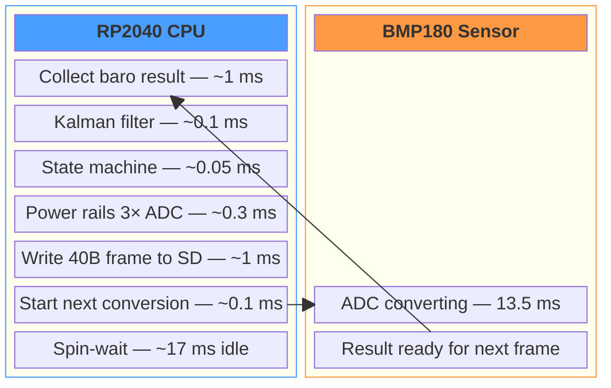
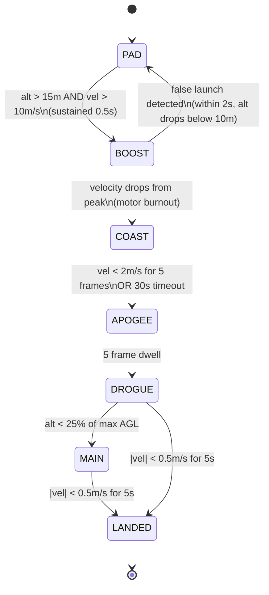
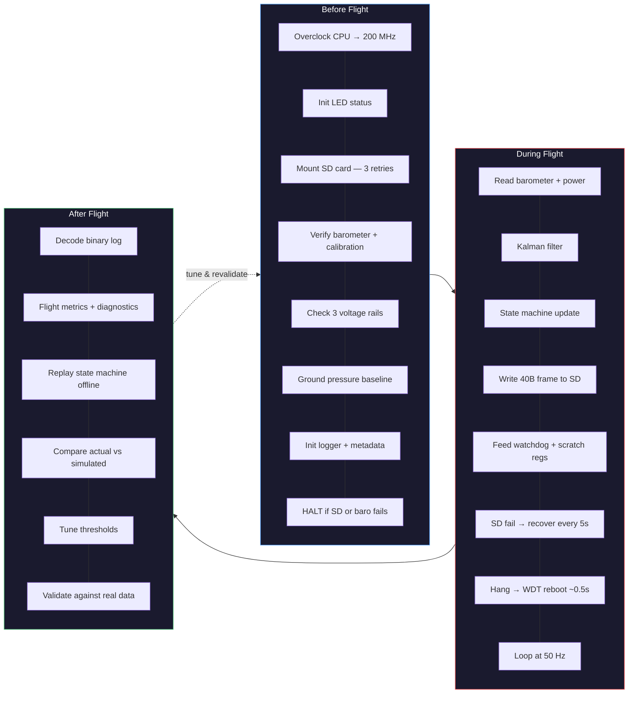

  <h1 align="center">🚀 MPR Altitude Logger</h1>
  

    <strong>Custom avionics flight computer — Raspberry Pi Pico — MicroPython</strong> 
    <em>1,843 lines on the Pico &nbsp;·&nbsp; 8,500 lines of ground tooling &nbsp;·&nbsp; 264 KB of RAM &nbsp;·&nbsp; no FPU</em>
  

 

> **TL;DR** — A from-scratch flight data logger for high-power rocketry, running a 50 Hz sensor loop with a Kalman filter, seven-state flight detection, three-rail power monitoring, and crash-recoverable binary logging — all on a $4 microcontroller.

 

---

 

## The Vision

The goal was straightforward: build a flight computer that could reliably log every moment of a rocket flight — from ignition through apogee to landing — and make that data useful after the fact. The catch was doing it on hardware that costs less than a textbook.

Most university rocketry teams buy commercial altimeters or use well-supported platforms like Teensy or STM32 with established flight software. We wanted to go a different direction. The Raspberry Pi Pico gave us a dual-core ARM processor, SPI and I2C peripherals, and enough GPIO for a barometer, SD card, and power monitoring — all for a few dollars. The trade-off was working within real constraints: 264 KB of RAM (not megabytes — kilobytes), no hardware floating-point unit, and MicroPython as the runtime, which meant every float operation was software-emulated and every unnecessary allocation mattered.

The creative challenge was treating those constraints as design parameters rather than limitations. Instead of reaching for a more powerful chip, we asked what was actually possible within the RP2040's budget — and it turned out to be a lot more than expected. A pipelined sensor architecture that overlaps I2C wait time with computation. A Kalman filter that derives velocity from pressure alone, no accelerometer needed. A 40-byte binary frame format efficient enough to give over 1,100 hours of recording on an 8 GB SD card. Crash recovery through watchdog scratch registers. The whole system — from preflight checks through flight logging to post-flight analysis — was designed around what this specific chip could do well, rather than fighting what it couldn't.

The result is a fully featured avionics data logger built from first principles on minimal hardware, with a ground station toolkit to match.

 

---

 

## Part 1 — What's Running on the Pico

The flight computer runs a 50 Hz sensor loop on an RP2040 overclocked to 200 MHz. Every 20 milliseconds it reads the barometer, runs a Kalman filter, updates a seven-state flight state machine, monitors three power rails, and writes a 40-byte binary telemetry frame to SD card — without allocating a single byte of heap memory in the hot path.

 

<strong>📂 Flight firmware breakdown — 1,843 lines across 9 files</strong>

 

| Module | Lines | Role |
|--------|------:|------|
| `main.py` | 564 | Boot sequence, preflight, sensor loop |
| `logging/datalog.py` | 376 | Binary frame writer, flush strategy, crash context |
| `sensors/barometer.py` | 238 | BMP180 I2C driver, pipelined reads, calibration |
| `flight/state_machine.py` | 172 | Seven-state FSM, launch detection, false-launch recovery |
| `flight/kalman.py` | 127 | 1D Kalman filter (altitude + velocity from pressure) |
| `utils/hardware.py` | 110 | LED blink patterns via hardware timer |
| `config.py` | 102 | Pin assignments, thresholds, tuning constants |
| `logging/sdcard_mount.py` | 92 | SD card SPI mount with retry logic |
| `sensors/power.py` | 62 | 3-rail ADC voltage monitoring |

 

### Sensor Pipeline

Barometer reads are pipelined: while the BMP180 spends 13.5 ms on its internal ADC conversion, the processor runs the filter, state machine, voltage monitoring, and SD write in parallel. The actual CPU work per frame takes about 2 ms. The rest of the frame budget is spent waiting for the sensor — time that would otherwise be wasted.

> Each frame repeats every **20 ms** (50 Hz). The CPU finishes its work in ~2 ms, kicks off the BMP180's internal ADC, then idles. The 13.5 ms conversion runs on the sensor chip independently — the result is collected at the start of the *next* frame, so the wait is completely hidden.

 

### Kalman Filter

A 1D Kalman filter estimates altitude and velocity from barometric pressure alone. There's no accelerometer on this board — velocity is inferred entirely from the filter's prediction-correction cycle. That's enough to reliably detect apogee and track every phase of flight.

 

### Flight State Machine

Seven flight states are detected and logged in real time. Launch detection uses a two-gate approach: altitude must rise above 15 m *and* velocity must exceed 10 m/s, both sustained for half a second. This prevents false triggers from wind, handling the board, or walking up stairs. If a false launch is detected within the first two seconds, the state machine resets itself automatically.

 

### Binary Logging

Each frame packs timestamp, flight state, raw and filtered altitude, velocity, three voltage rails, and six diagnostic channels into 40 bytes of binary data. Due to the efficiency of this format, the 8 GB SD card has a logging capacity of over 1,100 hours — storage is never the limiting factor.

### LED Feedback

Eight distinct blink patterns communicate system status at a glance — slow pulse for pad-ready, rapid flash for boost, triple-blink for landed, solid for error. These are driven by a hardware timer callback rather than a second thread, so they never interfere with the sensor loop.

 

---

 

## Part 2 — The Iteration Journey

The system went through three major revisions, each driven by real problems encountered during testing and ground runs.

 

### V1 — Getting data off the board

The first version focused on the basics: read the barometer, filter it, detect flight states, and log to SD. Frames were 28 bytes — timestamp, state, pressure, temperature, altitude (raw and filtered), velocity, a single battery voltage, and a flags byte.

V1 proved the core concept worked. The Kalman filter tracked altitude reliably, the state machine detected launch and apogee, and data made it to the SD card. But it only monitored one voltage rail, had no insight into system health during flight, and if anything went wrong mid-flight there was no way to diagnose it after the fact.

### V2 — Understanding the power system

The board has three independent voltage rails — 3.3 V for the MCU and sensors, 5 V for servo logic, and 9 V from the main battery through a buck/boost converter. V1 only monitored the battery. V2 expanded the frame to 32 bytes and added all three rails as independent channels.

This paid off immediately. During ground testing, we could see the 9 V rail dip during SD card flushes — a pattern that pointed directly to the battery's internal resistance under load. That kind of correlation between power behaviour and system events is only possible when the data is in the same time-synchronised log.

### V3 — The black box

V3 was the biggest step. The frame grew to 40 bytes with six new diagnostic fields: frame execution time (microseconds), SD flush duration, free heap memory, CPU temperature, cumulative I2C error count, and loop overrun count. The sample rate also doubled from 25 Hz to 50 Hz.

More importantly, V3 introduced crash recovery. The RP2040's watchdog peripheral has scratch registers — hardware registers that survive a reset. Before every flush, the firmware writes the current frame count and timestamp into these registers. If the watchdog fires and the system reboots, it reads the scratch registers, writes a crash report to the SD card, skips the full preflight sequence, and resumes logging within about half a second. Data already on the card is preserved.

The flight log became its own diagnostic tool. Every frame records how long it took to execute, so any performance anomaly that happens in flight — a slow SD write, an I2C bus stall, a memory pressure spike — shows up right alongside the altitude and velocity data.

 

### The tools evolved alongside the firmware

Each version also expanded the ground-station tooling. The binary decoder supports all three format versions with automatic detection. The postflight analyser reads the V3 diagnostic channels and flags anomalies. The state reprocessor can replay any flight log through an offline state machine with tuneable thresholds, producing a side-by-side comparison of what the firmware decided versus what different parameters would have produced.

 

<strong>📊 Binary frame format — V1 → V2 → V3 comparison</strong>

 

| Field | Bytes | V1 | V2 | V3 |
|-------|------:|:--:|:--:|:--:|
| Timestamp | 4 | ✓ | ✓ | ✓ |
| Flight state | 1 | ✓ | ✓ | ✓ |
| Pressure | 4 | ✓ | ✓ | ✓ |
| Temperature | 4 | ✓ | ✓ | ✓ |
| Altitude (raw) | 4 | ✓ | ✓ | ✓ |
| Altitude (filtered) | 4 | ✓ | ✓ | ✓ |
| Velocity | 4 | ✓ | ✓ | ✓ |
| Battery voltage | 2 | ✓ | — | — |
| 3.3V rail | 2 | — | ✓ | ✓ |
| 5V rail | 2 | — | ✓ | ✓ |
| 9V rail | 2 | — | ✓ | ✓ |
| Flags | 1 | ✓ | ✓ | ✓ |
| Frame time (μs) | 2 | — | — | ✓ |
| Flush time (μs) | 2 | — | — | ✓ |
| Free heap (KB) | 1 | — | — | ✓ |
| CPU temp (°C) | 1 | — | — | ✓ |
| I2C errors | 1 | — | — | ✓ |
| Loop overruns | 1 | — | — | ✓ |
| | | | | |
| **Frame total** | | **28 B** | **32 B** | **40 B** |
| **Sample rate** | | **25 Hz** | **25 Hz** | **50 Hz** |
| **Throughput** | | **700 B/s** | **800 B/s** | **2,000 B/s** |

 

**Flags byte breakdown** — four independent status bits encoded per frame:

| Bit | Flag | Meaning |
|:---:|------|---------|
| 0 | `ARMED` | Flight computer armed and logging |
| 1 | `DROGUE_FIRED` | Drogue chute deployment event detected |
| 2 | `MAIN_FIRED` | Main chute deployment event detected |
| 3 | `ERROR` | SD card write failure or I2C fault |
| 4–7 | — | Reserved |

A frame with no flags set reads as `SAFE`. Multiple flags can be active simultaneously — e.g. `ARMED|DROGUE_FIRED` during descent.

 

---

 

## Part 3 — Reliability by Design

Every design decision was shaped by one question: *what happens when something goes wrong at 3,000 feet?*

 

### Before flight — preflight checks

Every boot runs a seven-step preflight sequence: overclock the CPU, initialise the status LED, mount the SD card (with retries), verify the barometer (chip ID, calibration data, and a live reading), check all three voltage rails against spec, calibrate the ground-level pressure from 50 averaged samples, and initialise the logger. If the SD card or barometer fails, the system halts — it won't fly without working storage or sensing.

A separate preflight TUI tool connects from a laptop over USB and walks through each subsystem with a GO / NO-GO assessment and live telemetry monitoring, so the team can verify the board on the pad.

### During flight — graceful degradation

If the SD card fails mid-flight, the sensor loop keeps running. Every five seconds it attempts recovery by opening a new file in a new folder — data already written is safe, and if the card comes back the system picks up where it left off.

Every frame starts with a sync header (`0xAA 0x55`), so the decoder can resync after a corrupted or partial write. The flush strategy balances data safety against throughput: buffered writes with a flush every second and a full FAT metadata sync every three seconds. State transitions — launch detected, apogee reached, landed — trigger an immediate flush, because those are the moments that matter most.

I2C bus errors are caught and counted but don't crash the loop. The watchdog is fed at every safe point — during SD flushes, barometer waits, and each loop iteration — so a genuine hang triggers a fast reboot rather than silence.

### After flight — closing the loop

The postflight tool downloads and decodes the binary log, presenting flight metrics, state transitions, power trends, and all six diagnostic channels. The state reprocessor replays the recorded data through an offline state machine, so thresholds can be tuned against real flight data without re-flying.

The flight simulator generates predicted altitude and velocity profiles from rocket parameters and motor thrust curves (with a built-in motor database and OpenRocket import support). Overlaying predicted versus actual profiles validates the aerodynamic model and highlights where reality diverged from the simulation.

 

### Benchmarking on real hardware

An eight-test diagnostic suite runs directly on the Pico over USB:

| Test | What it measures |
|------|-----------------|
| **Sensor Bench** | 1,000 barometer reads — I2C latency distribution and pressure noise |
| **SD Card Bench** | 5 min sustained writes at flight rate — per-frame and flush latency |
| **Loop Budget** | Per-stage timing breakdown of the full pipeline against frame budget |
| **RAM Profile** | Memory cost of each object + 1,000-frame leak detection |
| **Float Precision** | 10,000 Kalman iterations checking for numerical drift |
| **Dual-Core Stress** | Jitter measurement with and without LED timer active |
| **Endurance Run** | 10 min continuous operation — timing drift, memory, thermal |
| **Error Injection** | Bad I2C, mid-write SD removal, extreme inputs — graceful recovery |

The pipelined barometer reads, the pre-allocated buffers, and the tuned flush intervals all came directly out of this benchmarking cycle. The diagnostics aren't an afterthought — they're how the firmware was built.

 

---

  <em>Built for UNSW Rocketry — targeting the Australian Universities Rocketry Challenge 2026.</em>

